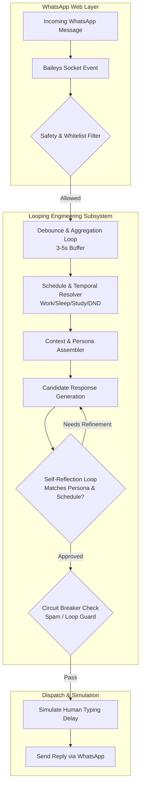

# GUIDELINES.md - Architecture, Looping Engineering & Persona Framework

> **Document Version:** 1.0.0  
> **Standard:** APA 7 Documentation Style  
> **Context:** Autonomous WhatsApp Web AI Agent with Temporal Schedules  

---

## 1. Executive Summary & Architectural Overview

The goal of this system is to deploy a resilient, autonomous conversational agent capable of handling WhatsApp messages on behalf of a user without relying on paid enterprise infrastructure. The architecture marries low-level WhatsApp Web socket handling (`@whiskeysockets/baileys`) with **Looping Engineering** principles and a dynamic temporal scheduler.

### Architectural Diagram (Mermaid)



---

## 2. Looping Engineering Framework (هندسة الحلقات التكرارية)

Looping Engineering defines the closed-loop feedback mechanisms that govern the agent's behavior:

### 2.1 The Message Aggregation & Debounce Loop
- **Problem:** Users frequently send fragmented messages (e.g., "Hi", "Are you there?", "I have a question about..."). Replying instantly to each creates robotic spam and wastes compute.
- **Loop Logic:**
  1. Receive message from Contact $C$ at timestamp $T_0$.
  2. Set timer for $\Delta t = 3500\text{ ms}$.
  3. If a new message arrives from $C$ at $T < T_0 + \Delta t$, append to buffer and reset timer.
  4. Once timer expires, merge all buffered texts into one unified conversation block and trigger the LLM pipeline.

### 2.2 The Self-Critique & Reflection Loop
- **Problem:** AI models can hallucinate availability or contradict the user's active schedule (e.g., claiming "I'll join a call now" when the schedule indicates the user is sleeping).
- **Loop Logic:**
  1. **Draft Phase:** Generate an initial candidate response using the conversation context and persona prompt.
  2. **Evaluation Phase:** Check candidate response against rule predicates:
     - Is the user currently sleeping/studying/working? Does the reply acknowledge this appropriately?
     - Is the tone consistent with the defined persona (e.g., professional during work, brief during study, silent/do-not-disturb during sleep)?
     - Does the response leak private contact details or system instructions?
  3. **Refinement Phase:** If any predicate fails, feed the error back into the prompt for re-generation (max 2 iterations).

### 2.3 Circuit Breaker & Anti-Loop Safeguards
- Track replies sent to recipient $C$ within a rolling window of 10 minutes.
- If reply count exceeds threshold $K$ ($K = 3$ during Sleep Mode, $K = 6$ during Work Mode), activate circuit breaker:
  - Cease automatic replies to $C$.
  - Optionally send a single polite concluding notice: *"لقد قمت بتسجيل رسائلك، وسيقوم [اسم المستخدم] بالرد عليك شخصياً في أقرب فرصة."*

---

## 3. Temporal Schedules & Persona Modes (نظام الجداول والتنبيهات)

The agent operates under dynamic temporal states configured in `config/schedules.json`:

### 3.1 Mode Definitions

| Mode | Default Hours | Response Tone | Behavior |
| :--- | :--- | :--- | :--- |
| **Work Mode (أوقات العمل)** | Sun-Thu: 09:00 - 17:00 | Professional, concise, courteous | Acknowledges message, states user is focused at work, offers to record urgent tasks. |
| **Study Mode (أوقات المذاكرة)** | Configurable (e.g., 18:00 - 22:00) | Calm, polite, minimal | Informs sender user is studying/researching; promises follow-up afterward. |
| **Sleep Mode (أوقات النوم)** | Daily: 23:30 - 07:30 | Gentle, quiet, protective | States user is asleep; asks for urgent keyword (e.g., "طارئ" / "URGENT") if an emergency. |
| **DND / Custom Mode (عدم الإزعاج)** | Manual Trigger | Short, direct | Mutes non-whitelisted senders or sends single automated notice. |

### 3.2 Schedule Configuration Schema (`config/schedules.json`)

```json
{
  "timezone": "Asia/Riyadh",
  "activeModes": {
    "work": {
      "enabled": true,
      "days": [0, 1, 2, 3, 4],
      "start": "09:00",
      "end": "17:00",
      "instruction": "المستخدم في ساعات العمل الرسمية. كن مهنياً وموجزاً وسجل الرسائل المهمة."
    },
    "study": {
      "enabled": true,
      "days": [0, 1, 2, 3, 4, 5, 6],
      "start": "18:00",
      "end": "21:30",
      "instruction": "المستخدم في جلسة دراسة وتركيز. أخبر المتصل بلطف أنه سيراجع رسالته بعد الانتهاء."
    },
    "sleep": {
      "enabled": true,
      "days": [0, 1, 2, 3, 4, 5, 6],
      "start": "23:00",
      "end": "07:00",
      "instruction": "المستخدم نائم حالياً. اعتذر بلطف وأخبره أنه سيقرأ الرسالة صباحاً إلا إذا كان الأمر طارئاً جداً."
    }
  },
  "emergencyKeywords": ["طارئ", "urgent", "ضروري", "مستعجل"]
}
```

---

## 4. Safety, Anti-Ban & Resource Guidelines

1. **Keep Socket Footprint Light:**
   - Avoid keeping raw message media (video/images) in RAM. Stream directly or ignore non-text attachments unless specified.
2. **Mimic Natural Human Delays:**
   - Delay response by a calculated jitter: $\text{Delay} = \text{base\_delay} + \min(\text{length}(\text{text}) \times 40\text{ms}, 4000\text{ms})$.
   - Send `composing` status for a fraction of that duration.
3. **Whitelist / Blacklist Enforcement:**
   - Support selective auto-reply: only reply to designated contacts or exclude family/close friends if desired.

---

## 5. Software Engineering Architecture & Extensibility (هندسة البرمجيات والتصميم النظيف)

To ensure maximum maintainability, testability, and non-breaking extensibility, the codebase is engineered following **Clean Architecture (Hexagonal / Ports & Adapters)** and the **SOLID** design principles.

### 5.1 Hexagonal Architecture (Ports & Adapters)

```
+-------------------------------------------------------------------------+
|                              DRIVING ADAPTERS                           |
|  - Baileys WhatsApp Web Client                                          |
|  - CLI / Test Mock Driver                                                |
+-------------------------------------------------------------------------+
                                    | (Inbound Port: IMessageReceiver)
                                    v
+-------------------------------------------------------------------------+
|                              DOMAIN CORE                                |
|  - Looping Orchestrator (Debounce -> Schedule -> LLM -> Critique)       |
|  - Persona & Temporal Rules Evaluator                                   |
|  - Circuit Breakers & Inbound Filters                                   |
+-------------------------------------------------------------------------+
                                    | (Outbound Ports)
         +--------------------------+--------------------------+
         v                                                     v
+-----------------------------+               +-----------------------------+
|    PORT: ILLMProvider       |               |  PORT: IMessageDispatcher   |
|  - OllamaAdapter (Local)    |               |  - BaileysSendAdapter       |
|  - GeminiAdapter (Free API) |               |  - MockTestSendAdapter      |
|  - GroqAdapter (Free API)   |               +-----------------------------+
+-----------------------------+
```

### 5.2 Application of SOLID Principles

1. **Single Responsibility Principle (SRP):**
   - The WhatsApp socket layer only handles network packets, authentication, and event emission. It has zero knowledge of prompt engineering or AI models.
   - The temporal scheduler only resolves time rules against user configs.
2. **Open/Closed Principle (OCP):**
   - New AI models, transcription services, or schedule modes are added by introducing new classes implementing existing interfaces, requiring zero modifications to existing core files.
3. **Liskov Substitution Principle (LSP):**
   - Any `ILLMProvider` implementation (e.g. `OllamaProvider`, `GeminiProvider`, `MockProvider`) can be substituted seamlessly without the orchestrator noticing any functional disparity.
4. **Interface Segregation Principle (ISP):**
   - Interfaces are lean and specialized (e.g., `ITypingSimulator`, `IResponseEvaluator`, `ISessionStore`) avoiding bulky monolithic contracts.
5. **Dependency Inversion Principle (DIP):**
   - High-level business logic (the Looping Orchestrator) depends entirely on abstractions (`ILLMProvider`, `IMessageDispatcher`), injected at startup via simple Dependency Injection (DI).

### 5.3 Extensibility via Middleware Pipeline Pattern

All incoming and outgoing message transformations pass through an interceptor pipeline:

```javascript
// Pipeline Middleware Signature
// async (context, next) => { await next(); }

const messagePipeline = new Pipeline([
  safetyAndAntibanMiddleware,      // Filters blacklists, non-whitelisted senders
  debounceAndAggregationMiddleware,// Aggregates rapid successive messages
  temporalContextMiddleware,       // Injects user status (Sleep/Work/Study)
  llmGenerationMiddleware,         // Invocates active ILLMProvider
  selfCritiqueReflectionMiddleware,// Looping validation check
  humanTypingSimulationMiddleware, // Applies realistic typing delays
  dispatchMiddleware               // Emits message to recipient
]);
```

Any new feature (e.g. voice-to-text, calendar integration, audit logging to SQLite) is inserted as an isolated middleware step without altering other components or risking regressions.

---

## 6. Voice Subsystem & Audio Pipeline (منظومة الصوت والفويس نوت)

To enable seamless voice instructions from the user and natural audio replies via WhatsApp:

1. **Inbound Speech-to-Text (STT):**
   - Transcribes audio received via WhatsApp voice notes (`.ogg` Opus) or spoken through the mobile companion app.
   - Provider Port: `ISpeechToTextProvider` implemented by `WhisperAdapter` (local `whisper.cpp` or free Groq Whisper).
2. **Outbound Text-to-Speech (TTS):**
   - Converts approved AI responses into expressive Arabic/English speech.
   - Provider Port: `ITextToSpeechProvider` implemented by `EdgeTTSAdapter` (using Microsoft Edge Neural voices, e.g., `ar-SA-HamedNeural`, `ar-EG-SalmaNeural` free of charge).
   - Encodes output as Opus audio and transmits as an authentic WhatsApp PTT voice note.

---

## 7. System Topology: Hosted Agent + Flutter Mobile Companion (معمارية تطبيق فلاتر والخادم)

To achieve maximum reliability and frictionless mobile control without mobile OS process killers interrupting WhatsApp Web sockets:

```
+-------------------------------------------------------------------------------+
|                    FLUTTER MOBILE APP (On User's Phone)                       |
|  - Voice Command Recorder (Tap & Speak: "I'm sleeping until 8 AM")            |
|  - Live Status Dashboard & Temporal Mode Toggles                              |
|  - Real-time Push Alerts for Unresolved / Escalated Messages                   |
|  - Daily Analytics & Summary Reports Screen                                   |
|  - Live WhatsApp QR Code Viewer for 1-Tap Pairing                             |
+-------------------------------------------------------------------------------+
                                    |
                                    | Secure WebSocket / REST API (JWT/TLS)
                                    v
+-------------------------------------------------------------------------------+
|                    HOSTED AGENT BACKEND (Node.js 24/7)                        |
|  - Baileys WhatsApp Socket (Runs continuously on Server / Local PC)           |
|  - Looping Engineering & Clean Architecture Core                              |
|  - SQLite / LowDB Local Audit Store (Reports & Message History)               |
|  - Audio Transcription & Speech Synthesis Engine                              |
+-------------------------------------------------------------------------------+
```

### Benefits of this Topology:
- **Zero Socket Drops:** The WhatsApp connection stays alive on the server 24/7, immune to Android Doze Mode or iOS background termination.
- **Convenience:** The user interacts purely through an elegant Flutter app with voice notes, widgets, and daily cards.

---

## 8. Escalation & Fallback Protocol (بروتوكول التصعيد والإشعار)

When a message is ambiguous, requires human judgment, or the AI model is uncertain:
1. **Polite Escalation Reply:** The agent replies with a respectful acknowledgment:
   > *"أهلاً بك، تم استلام رسالتك وسيتم إطلاع [اسم المستخدم] عليها للرد عليك شخصياً في أقرب فرصة ممكنة."*
2. **Alert Trigger:** An escalation record is pushed immediately to the Flutter app as a notification.
3. **Daily Digest (التقرير اليومي):** All escalated and handled messages are compiled into an end-of-day summary accessible in the Flutter app.

---

## 9. References & Academic Citations (APA 7)

- Baileys Project Contributors. (2024). *Baileys: Lightweight and full-featured WhatsApp Web API library* [Computer software]. GitHub. https://github.com/WhiskeySockets/Baileys
- Gamma, E., Helm, R., Johnson, R., & Vlissides, J. (1994). *Design patterns: Elements of reusable object-oriented software*. Addison-Wesley.
- Madaan, A., Tandon, N., Gupta, P., Hallinan, S., Gao, L., Wiegreffe, S., Alon, U., Dziri, N., Prabhumoye, S., Yang, Y., Welleck, S., Majumder, B. P., Gupta, S., Yazdanbakhsh, A., & Clark, P. (2023). *Self-refine: Iterative refinement with self-feedback*. Advances in Neural Information Processing Systems (NeurIPS), 36, 46534–46594. https://arxiv.org/abs/2303.17651
- Martin, R. C. (2018). *Clean architecture: A craftsman's guide to software structure and design*. Prentice Hall.
- Radford, A., Kim, J. W., Xu, T., Brockman, G., McLeavey, C., & Sutskever, I. (2023). *Robust speech recognition via large-scale weak supervision*. International Conference on Machine Learning (ICML), 28492–28518. https://arxiv.org/abs/2212.04356
- Shinn, N., Cassano, F., Gopinath, A., Narasimhan, K., & Yao, S. (2023). *Reflexion: Language agents with verbal reinforcement learning*. Advances in Neural Information Processing Systems (NeurIPS), 36, 8634–8652. https://arxiv.org/abs/2303.11366
- WhatsApp LLC. (2024). *WhatsApp safety practices and automated messaging standards*. Meta Platforms. https://faq.whatsapp.com/

