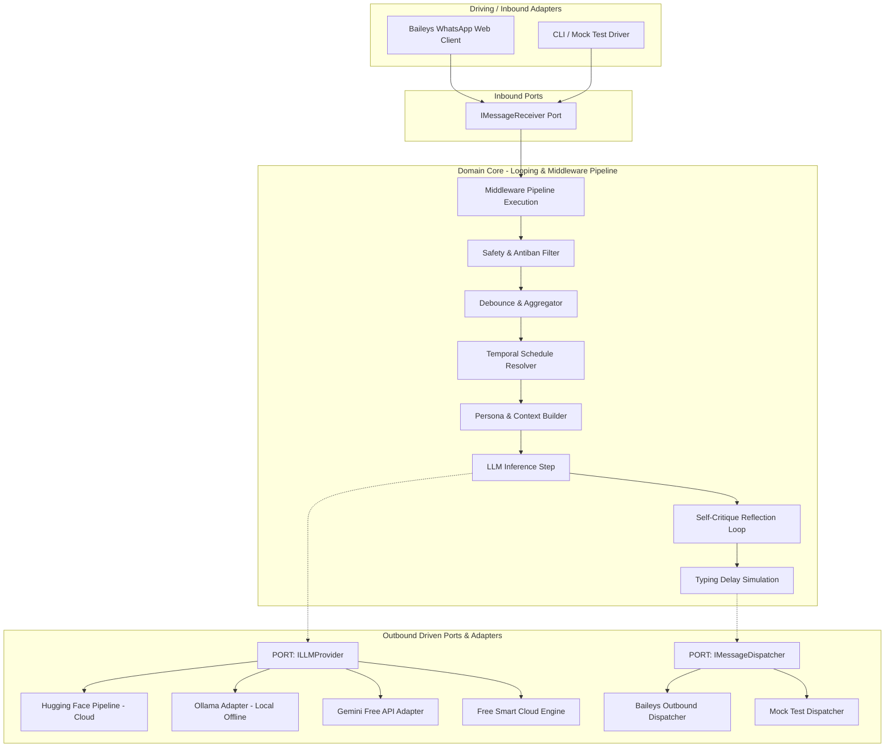

# PROJECT_MEMORY.md - Project Graph Memory & Knowledge Graph

> **Graph State:** Initialized (Phase 1: Foundation & Customization Complete)  
> **Last Synchronized:** 2026-09-18  

---

## 1. Project Entity Graph (Hexagonal Architecture & Looping Engine)

---

## 2. Knowledge Nodes & State Register

| Node ID | Type | Status | References / Path | Key Properties |
| :--- | :--- | :--- | :--- | :--- |
| `CONF_AGENTS` | Rule Document | Active | [AGENTS.md](file:///d:/Projects/agents/AGENTS.md) | Behavioral rules, APA 7, Safety, SOLID standards |
| `CONF_GEMINI` | Dev Document | Active | [GEMINI.md](file:///d:/Projects/agents/GEMINI.md) | Node.js guidelines, Clean Architecture, DI, error handling |
| `CONF_GUIDELINES` | Spec Document | Active | [GUIDELINES.md](file:///d:/Projects/agents/GUIDELINES.md) | Looping engineering, Hexagonal architecture, SOLID, schedules |
| `SKILL_LOOP` | Skill | Active | [.agents/skills/looping-engineering/SKILL.md](file:///d:/Projects/agents/.agents/skills/looping-engineering/SKILL.md) | Feedback loops, self-critique, debouncing |
| `SKILL_WA` | Skill | Active | [.agents/skills/whatsapp-automation/SKILL.md](file:///d:/Projects/agents/.agents/skills/whatsapp-automation/SKILL.md) | Baileys session management, QR auth |
| `SKILL_SCHED` | Skill | Active | [.agents/skills/ai-persona-scheduler/SKILL.md](file:///d:/Projects/agents/.agents/skills/ai-persona-scheduler/SKILL.md) | Timezone calculation, persona adaptation |
| `SKILL_SAFE` | Skill | Active | [.agents/skills/safety-and-antiban/SKILL.md](file:///d:/Projects/agents/.agents/skills/safety-and-antiban/SKILL.md) | Anti-ban, typing jitter, contact filters |
| `SKILL_VOICE` | Skill | Active | [.agents/skills/voice-and-audio-io/SKILL.md](file:///d:/Projects/agents/.agents/skills/voice-and-audio-io/SKILL.md) | STT (Whisper), TTS (Edge-TTS), voice commands |
| `STORE_MEMORY` | Entity | Active | [ConversationMemoryStore.js](file:///d:/Projects/agents/src/domain/memory/ConversationMemoryStore.js) | Multi-turn ring buffer conversational memory per contact |
| `STORE_BRIEFING` | Entity | Active | [ExecutiveBriefingStore.js](file:///d:/Projects/agents/src/domain/memory/ExecutiveBriefingStore.js) | Structured executive digest & briefing cards generator |
| `MW_ADMIN_DELEGATION`| Middleware | Active & Verified | [AdminCommandMiddleware.js](file:///d:/Projects/agents/src/pipeline/middlewares/AdminCommandMiddleware.js) | Self-chat commands, reports, and outbound contact delegation ("رد على فلان") |
| `SCHED_DYNAMIC_STATUS`| Core Feature | Active & Verified | [TemporalScheduler.js](file:///d:/Projects/agents/src/scheduler/TemporalScheduler.js) | Dynamic user custom status with JSON persistence and contact reply tailoring |
| `HF_MODEL_FREE` | Adapter Config | Active & Verified | [.env](file:///d:/Projects/agents/.env) | `Qwen/Qwen2.5-Coder-7B-Instruct` on Hugging Face (100% free serverless tier) |
| `FLUTTER_APP` | Companion UI | Planned (Phase 3) | `d:/Projects/agents/mobile_app/` | Mobile dashboard, voice controller, daily reports |
| `CORE_CODEBASE` | Implementation | Active & Verified | [src/index.js](file:///d:/Projects/agents/src/index.js) | Full Clean Architecture, Pipeline & Adapters |

---

## 3. Project Constraints & Architectural Invariants

1. **Clean Architecture & SOLID Compliance:** Domain core logic has zero direct dependencies on external SDKs; communication strictly through Ports (`ILLMProvider`, `IMessageDispatcher`).
2. **Zero Cross-Subsystem Regressions:** New features and integrations are plugged in as independent middleware or adapters without altering existing code.
3. **No Paid Official APIs:** Exclusively open-source WhatsApp Web protocols (Baileys / WPPConnect).
4. **Resource Thrifting:** Low memory footprint, no persistent heavy browser automation unless explicitly mandated.
5. **Looping Integrity:** No response dispatched without reflection and schedule alignment.
6. **Data Isolation:** No conversation content logged unencrypted; session files untracked in Git.
